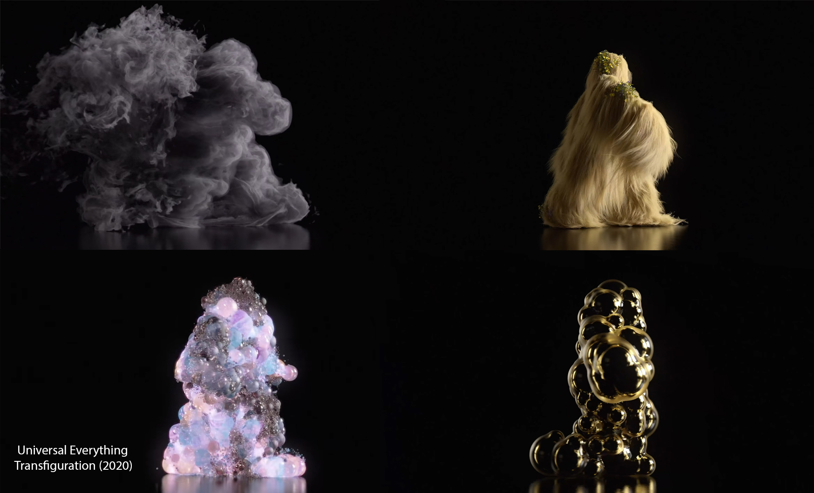
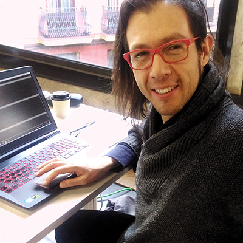

# Programando desde la creatividad
 En este repositorio de encuentran los ejericios presentado en la Master Class: Creative Coding, Programando desde la creativdad.

## Presentación
El anableps anableps es un pequeño pez que tiene cuatro ojos, es un pez que vive en zonas pantanosas y suele estar cerca de la superficie del agua. Sus ojos parecen los de una rana o una salamandra, pero están divididos en dos, cada globo ocular tiene dos pupilas, esto le permite ver bajo el agua y al ras de la superficie al mismo tiempo. Este pequeño ser me parece una metáfora perfecta para hablar de lo que es el creative coding, es combinar en una sola persona dos habilidades de mundo que parecen diferentes, pero en realidad son más afines de lo que pensamos: la computación y la creatividad.

Hay una larga trayectoria de artistas experimentando con computadoras, desde los tiempos en que las computadoras tenían el tamaño de edificios, pero el Creative Coding posiblemente surge con la iniciativa del Artista Científico, John Maeda al crear el grupo Aesthetics + Computation Group en el Media Lab del MIT. Esta iniciativa tuvo muchas repercusiones en el mundo de la tecnología y el arte. Ben Fry y Casey Reas, los creadores del Processing son egresados del Media Lab del MIT, el proyecto Arduino también tiene influencias de este espacio y OpenFranworks otra de las plataformas más usadas para programación de interactividad fue cofundada por Zach Lieberman, otro egresado del mismo espacio.

Gracias a estos proyectos la forma de hacer arte se ha transformado, ya que hicieron mucho más accesible el mundo de la computación a los diseñadores y artistas. Como consecuencia, también el mundo de la computación se ha nutrido a nivel estético y creativo.

p5js es la versión más actual del proyecto Processing y esta pensado completamente para su desarrollo en tecnologías web. Con este framework de JavaScript se pueden crear una gran cantidad de aplicaciones interactivas que funcionen a partir del explorador. Es una gran forma de acercarse al mundo de la programación, al mismo tiempo que es la posibilidad de explorar de forma fácil la veta creativa de la computación.

En esta Master Class se presentarán algunos proyectos representativos del Creative Coding, así como una introducción a p5js. Se presentará de forma práctica como iniciarse en esta plataforma.

***

### Temas

2.	¿Qué es el Creative Coding?
3.	Protagonistas, tecnologías y proyectos
4.	El proyecto Processing
5.	P5js
6.	Bibliotecas
7.	Ejemplos
8.	Hands-On

## Slides

<https://docs.google.com/presentation/d/1q4ATepbuUnKqU6-4rVXErL10PGsk1ZT5JEgx1fhNxEU/edit?usp=sharing>

## Materiales del concurso

<https://github.com/JoakuDeSotavento/dance-the-cloud/tree/main/materiales>

## Libros

Esta es una selección de los mejores libros para estos menesteres

--------  drive.google.com/file/d/1EdUHApmi8gDPhFTLEqCSNj-p55fkkJvF/view?usp=sharing -------------

## Ejemplos

<https://arterobotico.com/blog/>

## Links de insteres

<https://www.lozano-hemmer.com/pareidolium.php>

<https://www.random-international.com>

<https://zachlieberman.medium.com/land-lines-e1f88c745847#.35loqxn62>

## Autor

**Joaquín R. Díaz Duran**
aka **Joaku de Sotavento**

Joaquín Díaz Durán (1982, Ciudad de México) actualmente cursa el programa de Doctorado en Investigación en Humanidades Artes y Educación de la UCLM (España). Desarrolla su investigación Inside The Stomach of a Robot en vinculación a Medialab-Prado.
El año pasado presentó su trabajo con la Interfaz Cyborg en los festivales Scratxe#13 en Vitoria-Gasteiz, Ctrl Art Supr en el Hostal Bastardo en Madrid y en colaboración con el cineasta Francisco Bouzas presentan la performance Un Juego Latente en Tabakalera-Donostia. Ha impartido talleres de arte interactivo, diseño de interfaces y robótica en la Fundación Telefónica de Madrid (Marzo 2019), en MediaLab Prado (Abril y Diciembre 2019) y en el Festival Future Places, Portugal (Octubre 2017). Del 2012 al 2015 formó parte del equipo de robótica del laboratorio de Birobotics de la UNAM encargado del diseño y construcción de la apariencia del robot Justina, participando en los concurso Robocup (México 2012, Holanda 2013, Brasil 2014 y China 2015) y RockIn (Portugal 2015).

[twitter](https://twitter.com/joaku_Sotavento) |
[web](https://www.arterobotico.com) |
[github](https://github.com/JoakuDeSotavento) |
